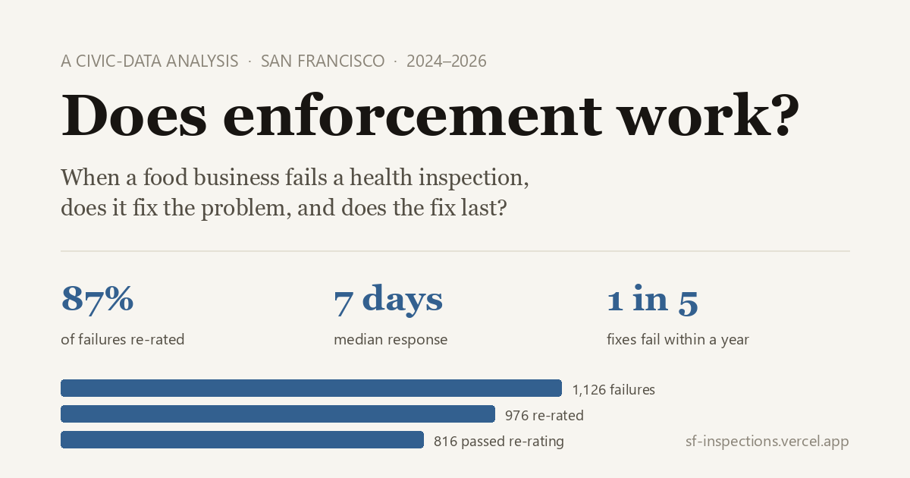

# SF Health Inspections: does enforcement work?

When a San Francisco food facility fails a health inspection or is closed,
does it improve, and does the improvement hold? This repo is the full
pipeline and analysis behind that question, built end-to-end as a portfolio
piece: Socrata ingest, DuckDB/MotherDuck warehouse, dbt models, and a static
dashboard with a written findings report.

**Live site:** [sf-inspections.vercel.app](https://sf-inspections.vercel.app) ·
[Findings report](https://sf-inspections.vercel.app/report) ·
[Methodology](https://sf-inspections.vercel.app/methodology)



## Findings, briefly

- **Response is fast.** Median 1 day from closure to re-rating, 8 days from
  conditional pass; 87% of the 1,126 failures since 2024 got a follow-up rating.
- **The first fix mostly works.** 75% of closures and 89% of conditional
  passes pass at resolution.
- **Durability is the weak link.** About 1 in 5 resolved failures fails again
  within a year, against a 4.5% baseline for facilities with no failure history.
  Relapse is a property of the facility, not the violation type.
- **Public signals see little.** Yelp ratings are uncorrelated with enforcement
  history (r = -0.065), and ~91% of complaint-triggered visits find zero
  violations; routine surveillance produces the large majority of closures.
- **Follow-up consistency varies by place** far more than response speed does:
  the share of stale unresolved failures spans 4-26% across supervisor districts.

Every number on the site carries its n, small samples are suppressed
(n≥30/n≥100 rules), every chart has a table twin, and the report states what
the data cannot establish.

## Data

| Source | Socrata ID | Role |
|---|---|---|
| Health Inspection Scores (2024-present) | `tvy3-wexg` | Analytical core. The only source that feeds outcome metrics. |
| Health Inspections (2020-2023) | `5tti-66ds` | Context only: facility tenure and history depth. |

The era split is deliberate. The older dataset uses a different rating
standard (LIVES, discontinued 2021), covers the COVID window, and has no
`permit_number`, so linking it to modern facilities is name-and-address
inference. It therefore never feeds failure, improvement, or durability
outcomes.

Two cross-reference sources, both name+address matched (inferred linkage,
flagged wherever used):

| Source | Role |
|---|---|
| Registered Business Locations (`g8m3-pdis`) | Splits unresolved failures into attrition (business died) vs censoring. |
| Yelp Fusion API | Present-day rating snapshot for failure cohort + control. Cross-sectional correlation only. Key in gitignored `.env`. |

## Architecture

Production runs entirely in the cloud:

- **State: MotherDuck** (`md:sf_inspections`). The append-only raw layer must
  outlive any runner; a fresh refetch would only capture the current snapshot
  and lose accumulated republish history.
- **Compute + schedule: GitHub Actions**
  (`.github/workflows/weekly-refresh.yml`, Mondays 16:00 UTC + manual
  dispatch): ingest → dbt build → export → deploy. `ci.yml` checks compile,
  dbt parse, and JS syntax on every push.
- **Hosting: Vercel**, static deploy from the workflow.

Every script switches between local file and MotherDuck through one function
(`ingest/fetch.py::connect`): set `MOTHERDUCK_TOKEN` and you are in the
cloud, unset and you are local. dbt: `DBT_TARGET=prod` or `dev`.

```
ingest/fetch.py            Socrata -> DuckDB raw layer (incremental + full refresh)
ingest/fetch_registry.py   business-registry candidates for unresolved failures
ingest/fetch_yelp.py       Yelp ratings, failure cohort + control (resumable)
dbt/                       staging + marts (timeline, enforcement episodes) + analyses
scripts/                   violation parsing/classification, MotherDuck migration
site/                      static dashboard (vanilla JS + SVG) + data export
schedule/                  legacy local Task Scheduler job (superseded by Actions)
```

## Pipeline contract

- **Append-only raw.** Republished record versions are kept; staging dedups
  with `ROW_NUMBER` over `data_as_of`.
- **Idempotent loads.** Every row carries `_row_hash` (MD5 of the canonical
  record JSON); loads anti-join on it, so re-running any window cannot
  duplicate rows.
- **Incremental** on `data_as_of >=` the landed watermark (`>=` so boundary
  ties are refetched and hash-deduped rather than silently skipped).
- **All raw columns are VARCHAR.** Casting is staging's job; a bad API value
  cannot fail a load.
- **Every run is logged** to `meta.ingest_runs` and `logs/ingest.log`,
  including failures.

## Analysis structure

- `dbt/models/marts/fct_enforcement_episodes.sql` — each failure paired with
  its next graded inspection and the one after, with deterministic window
  ordering (episodes are the unit of every outcome claim).
- `dbt/analyses/` — attrition split, Yelp correlation, equity cuts by
  supervisor district, relapse by violation category, complaint-inspection
  comparison. Each file carries its verified findings and caveats in the
  header.
- `scripts/parse_violations.py` — deterministic parser for the concatenated
  violation text field (97% exact agreement with recorded counts), with an
  LLM re-parse of the disagreeing remainder and a reviewed keyword ruleset
  for classification.

## Known data quirks

See `CLAUDE.md`. Headlines: records are republished with later `data_as_of`
(dedup before anything), inspection-type labels lag about a year behind the
data, umbrella permits (farmers markets) inflate per-permit counts,
`total_time` has negative values (untrusted), and `violation_codes`
concatenates code lists with statutory boilerplate.

## Setup

```
python -m venv .venv
.venv/Scripts/pip install -r requirements.txt   # duckdb pinned to MotherDuck-compatible version
python ingest/fetch.py                          # incremental, tvy3-wexg
python ingest/fetch.py --full-refresh
python ingest/fetch.py --era old                # one-time 2020-2023 snapshot
cd dbt && dbt build                             # DBT_TARGET=dev by default
python site/build_data.py                       # export dashboard JSON
```

Repo secrets for the workflow: `MOTHERDUCK_TOKEN`, `VERCEL_TOKEN`,
`VERCEL_ORG_ID`, `VERCEL_PROJECT_ID`. No secret has ever been committed;
`.env` is gitignored and the full history is clean.

## About

Built by [Luc Nguyen](https://www.linkedin.com/in/luchnguyen/).
Implementation was AI-assisted (Claude Code); the judgment calls documented
in the [methodology](https://sf-inspections.vercel.app/methodology) are mine.
